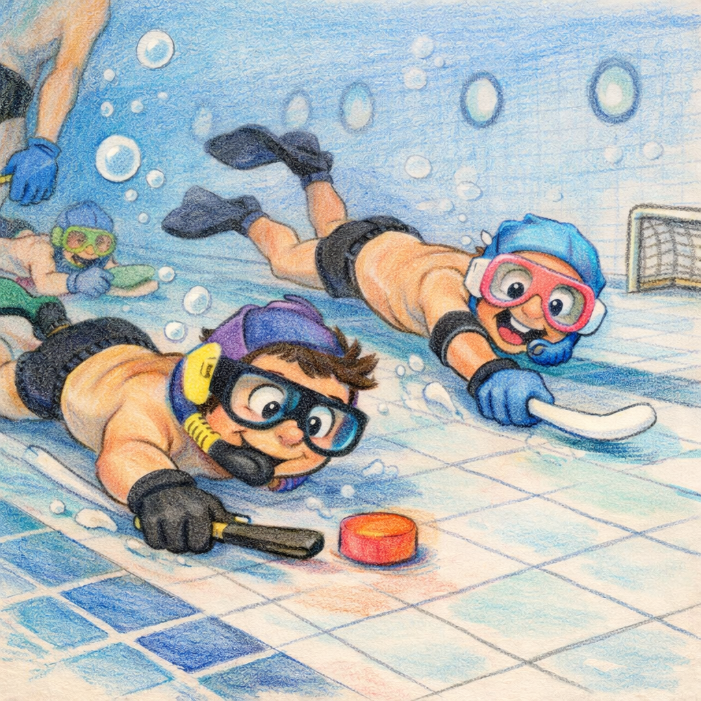

# Changements à implémenter

## Contexte
Suite de la session du 05/03/2026. Fonctionnalités planifiées et validées, pas encore codées.

---

## [TODO] Header Banner Illustration — 2026-03-25

### Décisions validées
- Remplacer le `<div class="card">` du titre par un `<header class="header-banner">` sémantique.
- Fond en dégradé bleu→crème (`linear-gradient 105deg`) intégrant une illustration aquarelle PNG à fond transparent.
- L'illustration est masquée en fondu via `mask-image` (côté gauche) pour une transition naturelle avec le dégradé.
- En mobile ≤ 768 px : colonne, illustration masquée (`display: none`), dégradé simplifié.
- Image **non commitable** : placée manuellement par l'utilisateur.

### Fichiers à modifier

| Fichier | Nature de la modification |
|---|---|
| `index.html` | Remplacer le bloc `<div class="card"><h1>…</h1></div>` par `<header class="header-banner">…</header>` |
| `assets/css/main.css` | Ajouter le bloc `/* === HEADER BANNER === */` après la règle `.card:hover` |
| `assets/css/responsive.css` | Ajouter les overrides mobiles dans la `@media (max-width: 768px)` existante |

### Tâches

- [x] **index.html** — Remplacer le `<div class="card">` entourant le `<h1>` (lignes ~20-25) par :
  ```html
  <header class="header-banner">
      <div class="header-banner__text">
          <h1 class="header-banner__title">Gestionnaire d'Équipes</h1>
          <p class="header-banner__subtitle">Hockey Subaquatique · Grenoble &amp; Jeeves</p>
      </div>
      <div class="header-banner__illustration" aria-hidden="true">
          
      </div>
  </header>
  ```

- [x] **assets/css/main.css** — Ajouter après `.card:hover { … }` le bloc complet `.header-banner` avec ses 6 règles BEM :
  `.header-banner`, `.header-banner__text`, `.header-banner__title`, `.header-banner__subtitle`,
  `.header-banner__illustration`, `.header-banner__img`
  (dégradé `105deg`, `min-height: 120px`, `mask-image` + préfixe `-webkit-mask-image`)

- [x] **assets/css/responsive.css** — Dans la `@media (max-width: 768px)` existante, ajouter le bloc `/* === HEADER BANNER MOBILE === */` :
  `flex-direction: column`, `display: none` sur l'illustration, `font-size` réduit pour titre et sous-titre

- [ ] **[MANUEL]** Créer le dossier `assets/images/` et y placer l'illustration `diver-hockey.png`
  (PNG à fond transparent, hauteur recommandée ≥ 160 px, orientation portrait ou format libre)

### Points d'attention

- **Fond transparent obligatoire** : sans transparence, le `mask-image` sera sans effet et le dégradé du bandeau sera occulté.
- **Fallback sans image** : si `diver-hockey.png` est absent, le bandeau reste cohérent (le côté droit affiche simplement la teinte crème du dégradé). Aucun `onerror` JS nécessaire.
- **Compatibilité Safari/iOS** : le préfixe `-webkit-mask-image` doit être écrit **avant** `mask-image` dans le CSS.
- **`<header>` sémantique** : vérifier qu'aucun style global `header { … }` existant dans `main.css` ou `components.css` n'entre en conflit avec `.header-banner`.
- **Namespace** : aucune modification JS, aucun export `window.App*` requis pour cette feature.

---

## 1. Navigation par onglets (mobile-first)

**Fichiers** : `index.html`, `assets/css/main.css`, `assets/js/ui.js`

### index.html
- Ajouter `<nav class="tab-bar">` juste après le `<h1>` avec 3 boutons :
  `data-tab="gestion"` , `data-tab="historique"` , `data-tab="stats"` 
- Envelopper tout le contenu existant dans `<div id="section-gestion" class="tab-section active">`
- Créer `<div id="section-historique" class="tab-section">` contenant `<div id="historiqueContainer">`
- Créer `<div id="section-stats" class="tab-section">` contenant `<div id="statsContainer">`
- Retirer l'ancien `<div id="historiqueContainer">` du bas de page

### assets/css/main.css  ajouter :

```css
.tab-bar { display:flex; background:white; border-radius:12px; padding:6px; gap:6px;
  box-shadow:0 2px 8px rgba(0,0,0,0.1); position:sticky; top:48px; z-index:100; }
.tab-btn { flex:1; padding:10px 8px; border:none; border-radius:8px; background:transparent;
  font-size:14px; font-weight:500; cursor:pointer; color:#555; transition:all 0.2s; min-height:44px; }
.tab-btn:hover { background:#f0f4f8; }
.tab-btn.active { background:#1976d2; color:white; }
.tab-section { display:none; }
.tab-section.active { display:contents; }
@media (max-width:768px) { .tab-bar { top:44px; } .tab-btn { font-size:12px; padding:10px 4px; } }
```

### assets/js/ui.js  ajouter :

```js
function switchTab(tabName) {
  document.querySelectorAll('.tab-btn').forEach(btn =>
    btn.classList.toggle('active', btn.dataset.tab === tabName));
  document.querySelectorAll('.tab-section').forEach(s =>
    s.classList.toggle('active', s.id === `section-${tabName}`));
  if (tabName === 'historique' && window.AppSessions) window.AppSessions.chargerHistorique();
  if (tabName === 'stats' && window.AppSessions) window.AppSessions.afficherStats();
}
```

Dans `attachEventListeners()`, ajouter :

```js
document.querySelectorAll('.tab-btn').forEach(btn =>
  btn.addEventListener('click', () => switchTab(btn.dataset.tab)));
```

Exporter `switchTab` dans `window.AppUI`.

---

## 2. Historique complet sans limite

**Fichier** : `assets/js/sessions.js`

Supprimer `.limit(10)` dans `chargerHistorique()`.

---

## 3. Page Statistiques joueurs

**Fichier** : `assets/js/sessions.js`

### 3a. `calculerStats()`  agrège V/N/D + historique de niveau par player_name
- Parcourt `window.AppCore.historiqueSessions[]`
- Pour chaque `session_teams[].session_players[]`, accumule V/N/D par `player_name`
- Stocke `{ date: session.date_session, niveau: player.niveau }` dans `historiqueNiveau[]`
- Retourne tableau trié par % victoires décroissant

### 3b. `afficherStats()`  injecte dans `#statsContainer`
- Tableau colonnes : Joueur / V / N / D / Matchs / %V
- Ligne verte si %V > 50%, rouge si < 40%
- Clic sur une ligne  toggle du bloc historique de niveau (masqué par défaut)
- Bouton "Exporter CSV" en haut

### 3c. `exporterStats()`  télécharge CSV
- Colonnes : `Joueur,Victoires,Nuls,Defaites,Matchs,%Victoires,Historique niveau`
- Champ historique : `date1:niveau1|date2:niveau2|...`
- BOM UTF-8 (`\uFEFF`) pour compatibilité Excel Windows
- Nom fichier : `stats_{club}_{YYYY-MM-DD}.csv`

Exporter les 3 dans `window.AppSessions`.

---

## 4. CSS pour les stats

**Fichier** : `assets/css/components.css`

Ajouter :

```css
.stats-table-wrapper { overflow-x:auto; -webkit-overflow-scrolling:touch; }
.stats-table { width:100%; border-collapse:collapse; font-size:14px; }
.stats-table thead th { background:#1976d2; color:white; padding:10px 12px; text-align:center;
  font-weight:600; position:sticky; top:0; }
.stats-table thead th:first-child { text-align:left; }
.stats-table tbody td { padding:10px 12px; text-align:center; }
.stats-table tbody td:first-child { text-align:left; font-weight:500; }
.stats-row { cursor:pointer; transition:background 0.15s; }
.stats-row:hover { background:#f0f4f8; }
.stats-row.stats-win { background:#f1f8e9; }
.stats-row.stats-lose { background:#fce4ec; }
.stats-v { color:#2e7d32; font-weight:600; }
.stats-n { color:#f57f17; font-weight:600; }
.stats-d { color:#c62828; font-weight:600; }
.history-toggle { font-size:11px; color:#1976d2; margin-left:6px; }
.niveau-history { padding:8px 12px; background:#f8f9fa; border-radius:6px; }
.niveau-history-row { padding:4px 0; font-size:13px; border-bottom:1px solid #eee; color:#555; }
.niveau-history-row:last-child { border-bottom:none; }
@media (max-width:768px) { .stats-table { font-size:13px; } }
```

---

## 5. Points d'attention

- `calculerStats()` compte les matchs **par match joué** (3 matchs/soirée = 3 entrées par joueur)
- `window.toggleHistorique` est réaffecté à chaque appel `afficherStats()`  pas de fuite mémoire
- Appeler `afficherStats()` à chaque switch vers l'onglet stats (pas de cache)
- Sans `.limit()`, `chargerHistorique()` peut être lent  envisager un spinner
- BOM `\uFEFF` indispensable pour Excel Windows avec UTF-8

---

## 6. Tests à ajouter (tests/tests.js)

- `calculerStats()` avec données mockées : V/N/D corrects
- `exporterStats()` appelable sans erreur
- Toggle historique niveau : show/hide correct
- Compatibilité import : ancien format (`gagnant_numero` numérique) et nouveau (`null`)


---

## 7. Re-notation des résultats de matchs (à implémenter)

**Décisions validées** :
- Correction nette : `correction = nouveau_delta - ancien_delta` appliqué sur le niveau actuel du joueur
- Cascade : les sessions ultérieures du même club sont remises à `ajustements_appliques = false`
- UX : bouton " Modifier résultats" visible sur toutes les sessions de l'historique

### Fichiers à modifier : `assets/js/sessions.js`, `assets/css/components.css`

### Tâches

- [ ] **`calculerDeltaSession(session)`**  nouvelle fonction utilitaire
  - Prend une session complète (avec `session_teams`, `session_players`, `match_results`)
  - Applique exactement la même formule que `calculerAjustements()` mais depuis le snapshot `session_players.niveau`
  - Retourne un objet `{ player_name: delta }` pour tous les joueurs de la session
  - Réutilisable pour comparer ancien et nouveau delta

- [ ] **`renoterResultats(sessionId)`**  point d'entrée UX
  - Récupère la session depuis `window.AppCore.historiqueSessions`
  - Calcule et mémorise l'ancien delta via `calculerDeltaSession()`
  - Affiche l'UI de saisie des résultats (réutilise `afficherInterfaceResultats()`) dans un panneau sous la session card
  - Si la session n'a pas encore de résultats : se comporte comme un "Saisir résultats"

- [ ] **`sauvegarderRenotation(sessionId)`**  sauvegarde et correction
  - DELETE + INSERT des nouveaux `match_results` (déjà idempotent dans `sauvegarderResultats`)
  - Calcule le nouveau delta via `calculerDeltaSession()`
  - Pour chaque joueur : `correction = nouveau_delta - ancien_delta`
  - UPDATE `players_xxx.niveau += correction` (clampé 110, arrondi à 1 décimale)
  - Marque la session : `resultats_saisis = true`, `ajustements_appliques = true`
  - **Cascade** : récupère toutes les sessions du même club avec `date_session > session.date_session` ET `ajustements_appliques = true`  UPDATE `ajustements_appliques = false`
  - Reload `chargerHistorique()`
  - Toast : "Résultats corrigés. X session(s) ultérieure(s) remise(s) en attente."

- [ ] **`afficherHistorique()`**  ajouter bouton Modifier
  - Ajouter un bouton **" Modifier résultats"** (classe `btn-edit-outline`) sur **toutes** les session cards
  - Le placer à côté du bouton supprimer (trash)
  - Visible uniquement si `window.AppCore.isOnline`
  - Appel : `window.AppSessions.renoterResultats(session.id)`

- [ ] **`components.css`**  ajouter style bouton modifier
  ```css
  .btn-edit-outline { background: transparent; color: #1565c0; border: 1px solid #1565c0;
    padding: 6px; border-radius: 8px; cursor: pointer; display: inline-flex;
    align-items: center; transition: all 0.2s; }
  .btn-edit-outline:hover { background: #1565c0; color: white; }
  ```

- [ ] **`window.AppSessions`**  exporter `renoterResultats`, `sauvegarderRenotation`, `calculerDeltaSession`

### Points d'attention

- `calculerDeltaSession()` doit reproduire **exactement** la formule de `calculerAjustements()` : `DELTA_BASE * (1 + (oppAvg - myAvg) / 10)` pour une victoire, inverse pour une défaite, 0 pour un nul
- La correction nette préserve les ajustements des sessions intermédiaires légitimes
- Tester : session avec ajust. appliqués  modifier  vérifier correction nette sur `players.niveau`
- Tester cascade : 3 sessions en ordre, corriger la première  les 2 suivantes passent en attente
- Tester session sans résultats (doit se comporter comme "Saisir résultats")
- Le bouton "Modifier" ne doit pas apparaître en mode hors ligne (`isOnline = false`)

---

## 8. Formule Elo simplifié (remplace DELTA_BASE)

**Décisions validées** : `ELO_K = 0.3`, `ELO_DIVISOR = 4`, nuls donnent un delta , max ~0.23 par match vs équipe égale

### Fichiers à modifier : `assets/js/sessions.js`, `tests/tests.js`

### Tâches

- [x] `sessions.js`  constantes : remplacer `DELTA_BASE`
  - Supprimer : `const DELTA_BASE = 0.15;`
  - Ajouter : `const ELO_K = 0.3;` et `const ELO_DIVISOR = 4;`
  - Ces deux constantes remplacent intégralement DELTA_BASE dans toute la logique

- [x] `sessions.js`  `_calculerDeltaMatch(myAvg, oppAvg, resultat)` : nouvelle fonction privée
  - Déclarer avec `function` (pas `const`) immédiatement après les constantes, avant toute autre fonction
  - `resultat` : 1 = victoire, 0 = défaite, 0.5 = nul
  - Formule : `const expected = 1 / (1 + Math.pow(10, (oppAvg - myAvg) / ELO_DIVISOR));`
  - Retourne : `ELO_K * (resultat - expected)`
  - **Ne pas exporter**  fonction interne uniquement (préfixe `_`)

- [x] `sessions.js`  `calculerAjustements(sessionId)` : remplacer formule DELTA_BASE
  - **Supprimer** le `if (result.gagnant_id == null) return;`  les nuls ont maintenant un delta
  - Remplacer le bloc `if (gagnant_id === myTeamId) { totalDelta += ... } else { totalDelta -= ... }` par :
    ```js
    const res = result.gagnant_id == null ? 0.5
              : result.gagnant_id === myTeamId ? 1 : 0;
    totalDelta += _calculerDeltaMatch(myAvg, oppAvg, res);
    ```
  - `myAvg` et `oppAvg` calculés depuis `niveau_total / nb_joueurs` des équipes concernées

- [x] `sessions.js`  `calculerDeltaSession(session)` : même remplacement
  - Même suppression du `return` anticipé sur nul
  - Même remplacement du bloc DELTA_BASE par appel à `_calculerDeltaMatch`
  - Formule identique à `calculerAjustements` mais depuis snapshots `session_players.niveau`

- [x] `tests/tests.js`  vérifier et mettre à jour les tests impactés
  - Aucune valeur numérique `0.15` trouvée dans les tests existants  pas de valeur à changer
  - Ajouter une suite **"Formule Elo simplifié"** avec tests unitaires de `_calculerDeltaMatch` si elle est exposée, sinon tester via `calculerAjustements` mocké
  - Cas à couvrir : victoire équipes égales (+0.15), défaite équipes égales (0.15), victoire contre plus fort (+>0.15), nul entre égaux (0)

### Points d'attention

- **Ordre de déclaration** : `_calculerDeltaMatch` doit être déclarée avec `function` (hoisting) ou placée AVANT les deux fonctions appelantes dans le fichier
- **Suppression du `return` anticipé** : le `if (result.gagnant_id == null) return;` existe dans `calculerAjustements` ET `calculerDeltaSession`  supprimer dans les DEUX
- **Affichage des ajustements** : `afficherAjustements()` affiche désormais des deltas pour les nuls (ex: +0.02)  le rendu visuel changera légèrement, pas de modification CSS requise mais à valider visuellement
- **Note section 7 obsolète** : la section 7 de ce fichier mentionne la formule `DELTA_BASE * (1 + (oppAvg - myAvg) / 10)`  elle sera remplacée par Elo mais les sessions déjà sauvegardées en DB ne sont pas recalculées (comportement attendu)
- **Valeurs Elo de référence** pour validation manuelle :
  - Équipes égales : `expected = 0.5`  victoire `+0.15`, défaite `0.15`, nul `0`
  - Opp. +2 niveaux (`myAvg=5, oppAvg=7`) : `expected  0.24`  victoire `+0.23`, défaite `0.07`

---

## 9. Préparation du commit ranking Stats 3/1/0

**Décisions validées** :
- Périmètre limité à la feature ranking Stats avec barème 3/1/0
- Aucun changement de code métier dans cette étape, uniquement l'isolement du diff à committer
- Inclure `assets/js/sessions.js` et `tests/tests.js` seulement si ce sont les seuls fichiers réellement nécessaires

---

## 10. Maquette visuelle SVG isolée

**Décisions validées** :
- Produire une maquette en SVG autonome uniquement pour validation visuelle
- Représenter les zones clés : header, tabs, contexte club, formulaire, liste joueurs, stats
- Ne modifier aucun fichier applicatif existant ni aucun code métier
- Placer la maquette hors du flux applicatif réel dans un emplacement dédié

**Fichiers à modifier** :
- Nouveau fichier SVG isolé à créer dans un dossier de mockup dédié

**Tâches** :
- [ ] Créer un unique fichier SVG autonome présentant le nouveau look and feel global
- [ ] Structurer la maquette en sections distinctes pour les 6 zones produit attendues
- [ ] Prévoir un nommage et un emplacement explicites de type mockup/validation pour éviter toute confusion avec l'application réelle
- [ ] Limiter la maquette à un usage de revue visuelle, sans branchement HTML, CSS ou JS dans l'application

**Points d'attention** :
- Aucun import de la maquette dans [index.html](index.html)
- Aucun ajout dans [assets/js/core.js](assets/js/core.js), [assets/js/ui.js](assets/js/ui.js) ou les feuilles CSS existantes
- Le livrable doit rester facilement supprimable après validation d'UI

### Fichiers à modifier
- `CHANGELOG-TODO.md`

### Tâches

- [ ] **`assets/js/sessions.js`**  isoler le périmètre ranking
  - Vérifier que le diff retenu couvre uniquement calcul des points, tri, affichage Stats et export CSV Stats liés au ranking 3/1/0

- [ ] **`tests/tests.js`**  inclure uniquement les tests liés au ranking
  - Garder ce fichier hors du commit si aucun test ranking n'est requis

- [ ] **Staging Git**  exclure les changements non liés
  - Sortir du staging tout fichier hors périmètre
  - Utiliser un staging fin si un même fichier mélange ranking et changements non liés

- [ ] **Validation finale du diff stage**
  - Contrôler que le diff indexé ne contient que la feature ranking Stats 3/1/0 avant création du commit

- [ ] **Commit**  préparer le message
  - `feat: rank player stats with 3-1-0 scoring`

### Points d'attention

- Ne pas embarquer des ajustements adjacents sur l'historique, l'UI générale ou d'autres formules de score
- Si `assets/js/sessions.js` contient des changements mixtes, découper précisément le hunk au staging au lieu d'élargir le commit
- Vérifier la cohérence entre code indexé et tests indexés avant le commit
  - Opp. 2 niveaux (`myAvg=7, oppAvg=5`) : `expected  0.76`  victoire `+0.07`, défaite `0.23`
- **Pas de modification CSS** requise pour cette feature
- **Pas de modification Supabase**  logique purement JS côté client

---

## 9. Toggle tri joueurs (alphabétique / niveau décroissant)

**Décision validée** : toggle visible en haut de la liste joueurs (onglet Gestion), bascule entre tri alpha et tri niveau décroissant, état persisté dans `window.AppCore.triJoueurs`.

### Fichiers à modifier : `index.html`, `assets/js/ui.js`, `assets/css/components.css`

### Tâches

- [x] `index.html`  ajouter le toggle au-dessus de `#joueursContainer` (dans `#section-gestion`)
  - Deux boutons segmentés : "AZ" (`data-tri="alpha"`) et "Niveau " (`data-tri="niveau"`)
  - Placer après la barre de recherche, avant la liste des joueurs
  - Le bouton actif reçoit la classe `active`
  - HTML :
    ```html
    <div class="tri-toggle">
      <button class="tri-btn active" data-tri="alpha">A  Z</button>
      <button class="tri-btn" data-tri="niveau">Niveau </button>
    </div>
    ```

- [x] `assets/js/ui.js`  `afficherJoueurs()` : vérifier et compléter le tri
  - Si `triJoueurs === 'alpha'` : trier par `nom` (`localeCompare`)
  - Si `triJoueurs === 'niveau'` : trier par `niveau` décroissant, puis `nom` en cas d'égalité
  - Trier sur une copie du tableau  ne pas muter `window.AppCore.joueurs`

- [x] `assets/js/ui.js`  `attachEventListeners()` : brancher le toggle
  - Écouter `click` sur `.tri-btn`
  - `window.AppCore.triJoueurs = btn.dataset.tri`
  - Mettre à jour la classe `active` sur les boutons
  - Appeler `afficherJoueurs()`
  - Initialiser le bouton actif au chargement depuis `window.AppCore.triJoueurs`

- [x] `assets/css/components.css`  ajouter style `.tri-toggle` / `.tri-btn`
  ```css
  .tri-toggle { display: flex; gap: 4px; margin-bottom: 8px; }
  .tri-btn { flex: 1; padding: 6px 12px; border: 1px solid #1976d2; border-radius: 8px;
    background: transparent; color: #1976d2; font-size: 13px; font-weight: 500;
    cursor: pointer; transition: all 0.2s; }
  .tri-btn:hover { background: #e3f0fb; }
  .tri-btn.active { background: #1976d2; color: white; }
  ```

### Points d'attention

- **Initialisation** : lire `window.AppCore.triJoueurs` dans `attachEventListeners()` pour activer le bon bouton dès le chargement (valeur par défaut `'alpha'`)
- **Changement de club** : `changerClub()`  `afficherJoueurs()` relit `triJoueurs` automatiquement  aucune action supplémentaire
- **Recherche combinée** : le tri s'applique APRÈS le filtre `searchTerm` dans `afficherJoueurs()`  vérifier l'ordre filtre  tri  rendu
- **Pas de doublon** : `triJoueurs` existe déjà dans `window.AppCore`  ne pas redéclarer
- **Pas d'export supplémentaire** : `afficherJoueurs` et `attachEventListeners` sont déjà dans `window.AppUI`

---

## 10. Ranking Stats en 3/1/0 (Pts prioritaire)

**Décisions validées** :
- Nouveau ranking Stats basé sur `points = victoires * 3 + nuls`
- `historiqueNiveau` reste inchangé dans `calculerStats()`
- La métrique principale affichée et exportée devient **Pts** ; `%V` reste secondaire si conservé dans le tableau
- Le tri final doit être déterministe : points décroissants d'abord, puis départages stables
- `assets/css/components.css` ne doit être modifié que si le tableau devient moins lisible après ajout/remplacement de colonne

### Fichiers à modifier : `assets/js/sessions.js`, `tests/tests.js`, `assets/css/components.css` si nécessaire

### Tâches

- [ ] `assets/js/sessions.js`  `calculerStats()` : ajouter la métrique points sans casser les stats existantes
  - Calculer `points = victoires * 3 + nuls` dans l'objet agrégé retourné pour chaque joueur
  - Conserver `victoires`, `nuls`, `defaites`, `matchs`, `pct` et `historiqueNiveau` pour compatibilité UI/export/tests
  - Ne pas modifier la construction de `historiqueNiveau[]`

- [ ] `assets/js/sessions.js`  `calculerStats()` : remplacer le tri final par un ranking Pts d'abord
  - Remplacer le `.sort()` actuel basé sur `pct` par un tri déterministe : `points` décroissants, puis `pct` décroissant, puis `matchs` décroissants, puis `nom.localeCompare(..., 'fr')`
  - Vérifier qu'un nul départage correctement devant une défaite à volume de matchs équivalent

- [ ] `assets/js/sessions.js`  `afficherStats()` : faire de Pts la métrique principale du tableau
  - Mettre à jour l'en-tête pour afficher `Pts` comme colonne de ranking prioritaire
  - Réordonner les cellules pour aligner l'affichage sur le nouveau tri et l'export
  - Vérifier les valeurs de `colspan` et la ligne d'historique repliée après changement de colonnes
  - Mettre à jour tout libellé textuel faisant encore référence à `%V` comme indicateur principal

- [ ] `assets/js/sessions.js`  `afficherStats()` : aligner la coloration des lignes avec la métrique principale
  - Remplacer la logique `rowClass` basée uniquement sur `pct`, devenue incohérente avec un ranking par points
  - Soit basculer la coloration sur une logique liée aux points, soit neutraliser la coloration si aucun seuil métier clair n'est retenu
  - Éviter un état où l'ordre du tableau dit "Pts" mais la couleur dit encore "%V"

- [ ] `assets/js/sessions.js`  `exporterStats()` : exporter Pts et garder l'ordre de colonnes cohérent avec l'UI
  - Ajouter la colonne `Points` au CSV exporté
  - Aligner l'ordre des colonnes sur celui affiché par `afficherStats()`
  - Conserver le champ `Historique niveau` au format actuel
  - Vérifier que le BOM UTF-8 et le nom de fichier existants restent inchangés

- [ ] `tests/tests.js`  ajouter une suite dédiée au ranking 3/1/0 dans les stats
  - Tester que `calculerStats()` calcule bien `points = victoires * 3 + nuls`
  - Tester que le tri final classe d'abord par points, puis applique les départages déterministes attendus
  - Couvrir un cas métier simple : un joueur avec `1V 0N 1D` passe devant un joueur avec `0V 2N 0D`

- [ ] `tests/tests.js`  ajouter un test de rendu minimal pour `afficherStats()`
  - Vérifier que le tableau rendu affiche une colonne ou cellule `Pts`
  - Vérifier que la ligne détaillée d'historique utilise toujours le bon `colspan`
  - Vérifier que le rendu ne dépend pas d'une coloration `%V` obsolète pour rester cohérent

- [ ] `tests/tests.js`  ajouter un test d'export minimal pour `exporterStats()`
  - Vérifier que le CSV contient la colonne `Points`
  - Vérifier que l'ordre des colonnes exportées correspond à l'ordre retenu dans l'UI

- [ ] `assets/css/components.css`  n'ajouter un ajustement que si le tableau stats devient illisible
  - Ajuster seulement la largeur, l'alignement ou le comportement responsive des colonnes stats si l'ajout de `Pts` dégrade la lecture
  - Ne pas modifier les styles stats existants sans besoin constaté dans le rendu

### Points d'attention

- **Compatibilité fonctionnelle** : `pct` peut rester calculé pour information, mais il ne doit plus piloter le ranking principal ni contredire la hiérarchie visuelle
- **Cohérence UI / export** : mêmes colonnes, même ordre logique, même notion de métrique principale entre tableau HTML et CSV
- **Départages** : documenter dans le code l'ordre exact retenu pour éviter les régressions silencieuses au prochain ajustement du ranking
- **Colspan** : la ligne d'historique détaillée dans `afficherStats()` doit suivre automatiquement le nombre réel de colonnes après ajout/remplacement de `Pts`
- **CSS optionnel** : si aucun problème de lisibilité n'apparaît, ne pas ouvrir un chantier visuel inutile dans `assets/css/components.css`

---

## 11. "Autre proposition" — alternatives d'équipes équilibrées

**Décisions validées** :
- Après génération des équipes, un bouton "Autre proposition" permet de générer une configuration alternative
- L'alternative est obtenue par swaps de joueurs de niveaux proches (|delta| ≤ 1) entre équipes
- Chaque alternative repart de la proposition initiale (pas de dérive en cascade)
- La variation de moyenne par équipe ne doit pas excéder ±0.2 vs la configuration originale
- Unicité garantie via signature (max 10 tentatives, puis toast informatif)
- Un déplacement manuel via `changerEquipe()` invalide le mécanisme de proposition

### Fichiers à modifier

| Fichier | Nature de la modification |
|---|---|
| `assets/js/core.js` | 2 nouvelles variables globales + export `window.AppCore` |
| `assets/js/teams.js` | Nouvelle fonction `autreProposition()`, modifications de `creerEquipes()`, `afficherEquipes()`, `changerEquipe()` + export |
| `assets/css/components.css` | Flex layout pour le conteneur des boutons d'action équipes |

### Tâches

- [x] **`assets/js/core.js`**  déclarer 2 nouvelles variables globales
  - `let propositionOriginale = null;` (array|null) — copie profonde des équipes issues de `creerEquipes()`
  - `let historiquePropositions = [];` (array) — liste des signatures de configurations déjà proposées
  - Placer après les variables globales existantes (`historiqueSessions`, `currentUser`, etc.)

- [x] **`assets/js/core.js`**  ajouter les 2 variables dans l'export `window.AppCore = { … }`
  - Ajouter `propositionOriginale` et `historiquePropositions` dans l'objet exporté

- [x] **`assets/js/teams.js`**  nouvelle fonction utilitaire `_signatureEquipes(equipes)`
  - Fonction privée (non exportée), préfixée `_`
  - Pour chaque équipe : trier les IDs joueurs, concaténer en string
  - Trier les strings d'équipes entre elles pour rendre la signature indépendante de l'ordre des équipes
  - Retourner la concaténation finale (ex: `"1,3,5|2,4,6"`)
  - Déclarer avec `function` pour bénéficier du hoisting

- [x] **`assets/js/teams.js`**  modifier `creerEquipes()` : sauvegarder la proposition originale
  - Après le `forEach(sansGroupe)` et avant `afficherEquipes()` :
    - `window.AppCore.propositionOriginale = JSON.parse(JSON.stringify(window.AppCore.equipes));`
    - `window.AppCore.historiquePropositions = [_signatureEquipes(window.AppCore.equipes)];`

- [x] **`assets/js/teams.js`**  nouvelle fonction `autreProposition()`
  - **Garde** : si `!window.AppCore.propositionOriginale` ou `propositionOriginale.length < 2` → toast "Aucune alternative disponible", return
  - **Boucle max 10 tentatives** pour trouver une configuration unique :
    1. Deep-copy `propositionOriginale` dans une variable locale `candidat`
    2. Construire la liste de swaps candidats :
       - Pour chaque paire d'équipes (i, j) avec i < j
       - Pour chaque joueur `a` de `candidat[i]` et joueur `b` de `candidat[j]`
       - Exclure les joueurs avec `groupe` non null/undefined
       - Vérifier `|a.niveau - b.niveau| ≤ 1`
       - Simuler le swap : recalculer la moyenne de chaque équipe après échange
       - Vérifier que la variation de moyenne par équipe reste ≤ 0.2 vs `propositionOriginale`
       - Si valide, stocker le candidat `{ i, j, idxA, idxB, deltaMoyenne }`
    3. Si aucun candidat → toast "Aucune alternative disponible", return
    4. Trier les candidats par `deltaMoyenne` ascending
    5. Sélectionner aléatoirement 1 à 3 swaps non conflictuels (un joueur ne peut être swappé qu'une fois)
    6. Appliquer les swaps sur `candidat`
    7. Générer la signature via `_signatureEquipes(candidat)`
    8. Si signature déjà dans `historiquePropositions` → recommencer (tentative suivante)
    9. Sinon → configuration unique trouvée, sortir de la boucle
  - **Si 10 tentatives échouent** → toast "Toutes les variantes proches ont été explorées", return
  - **Appliquer** la configuration retenue :
    - Recalculer pour chaque équipe : `niveauTotal`, `meilleurNiveau`, tous les compteurs de postes (`avant`, `arriere`, `ailier`, `centre`, `pivot`, `arr_centre`, `indifferent`)
    - Stocker dans `window.AppCore.equipes`
    - Ajouter la signature dans `window.AppCore.historiquePropositions`
    - Mettre `window.AppCore.sessionValidee = null`
    - Vider `resultatsContainer` si existant
    - Appeler `afficherEquipes()`

- [x] **`assets/js/teams.js`**  dans `autreProposition()`, gérer la résolution du poste `indifferent` après swap
  - Quand un joueur avec poste original `indifferent` arrive dans une nouvelle équipe, recalculer son poste résolu (`avant` ou `arriere`) en fonction de la composition de l'équipe cible
  - Mettre à jour le compteur de poste de l'équipe source (décrémenter l'ancien poste) et de l'équipe cible (incrémenter le nouveau poste)

- [x] **`assets/js/teams.js`**  modifier `afficherEquipes()` : ajouter le bouton "Autre proposition"
  - Localiser le bloc `if (!window.AppCore.sessionValidee)` qui génère le bouton "Valider cette soirée"
  - Remplacer le `<div>` wrapper par un conteneur flex : `<div class="equipes-actions">`
  - Ajouter le bouton "Autre proposition" avec icône `shuffle` :
    ```html
    <button onclick="window.AppTeams.autreProposition()" class="btn btn-secondary" style="font-size: 16px; padding: 14px 32px;">
        <span class="material-icons">shuffle</span>
        Autre proposition
    </button>
    ```
  - Le bouton "Valider cette soirée" reste inchangé à côté
  - Les deux boutons sont dans le même conteneur `.equipes-actions`

- [x] **`assets/js/teams.js`**  modifier `changerEquipe()` : invalider le mécanisme de proposition
  - Après le déplacement manuel d'un joueur, ajouter :
    - `window.AppCore.propositionOriginale = null;`
    - `window.AppCore.historiquePropositions = [];`
  - Effet : le bouton "Autre proposition" disparaît au prochain `afficherEquipes()` car `propositionOriginale` est null

- [x] **`assets/js/teams.js`**  ajouter `autreProposition` dans l'export `window.AppTeams = { … }`

- [x] **`assets/css/components.css`**  ajouter le style du conteneur d'actions équipes
  ```css
  .equipes-actions {
    display: flex;
    justify-content: center;
    gap: 12px;
    margin-top: 20px;
    flex-wrap: wrap;
  }
  ```

### Points d'attention

- **Pas de dérive** : chaque alternative repart de `propositionOriginale`, jamais de la proposition courante. Empêche l'accumulation de micro-variations qui pourraient déséquilibrer les équipes.
- **Boucle infinie** : la limite de 10 tentatives et le toast informatif couvrent le cas où le pool de swaps est trop restreint (peu de joueurs, niveaux très hétérogènes).
- **1 seule équipe** : si `propositionOriginale.length < 2`, aucun swap possible. La garde en entrée de `autreProposition()` le couvre.
- **Résolution `indifferent`** : un joueur `indifferent` qui change d'équipe doit voir son poste résolu recalculé selon la composition de l'équipe cible. Les compteurs de poste des deux équipes doivent être mis à jour.
- **`changerEquipe()` invalide** : tout déplacement manuel rend `propositionOriginale` obsolète. Réinitialiser les deux variables et cacher le bouton empêche des alternatives incohérentes.
- **Signature indépendante de l'ordre des équipes** : trier les strings d'équipes entre elles, pas seulement les joueurs à l'intérieur. Sinon deux configurations identiques avec des équipes permutées seraient vues comme différentes.
- **Pas de test unitaire explicite dans ce plan** : envisager d'ajouter des tests pour `_signatureEquipes()` et `autreProposition()` avec données mockées dans une future section tests.
- **Performance** : la double boucle sur les paires de joueurs est O(n² × k²) avec k = nb joueurs/équipe. Acceptable pour ≤ 30 joueurs / 4 équipes mais non optimisée au-delà.

---

## 12. Bugfix "Autre proposition" — correctifs post code-review

**Contexte** : code-review de la §11 — 2 bugs MAJOR (M1, M2) et 3 MINOR (m1, m2, m3) identifiés dans `assets/js/teams.js`.

**Décisions validées** :
- Tous les correctifs portent sur `assets/js/teams.js`, fonction `autreProposition()` et `afficherEquipes()`
- Ordre d'application : M2+m1 → M1 → m2 → m3
- Aucun nouveau fichier, aucun nouvel export, aucune modification de schéma DB

### Fichiers à modifier

| Fichier | Nature de la modification |
|---|---|
| `assets/js/teams.js` | Correctifs M1, M2, m1, m2, m3 dans `autreProposition()` et `afficherEquipes()` |

### Tâches

- [x] **M2 — `autreProposition()` : corriger la résolution du poste `indifferent` après swap**
  - Les variables `origA` / `origB` lisent le poste depuis `propositionOriginale`, qui contient déjà des postes résolus (`avant`/`arriere`) et jamais `indifferent`
  - Remplacer les lookups `origA = window.AppCore.propositionOriginale[swap.i].joueurs[swap.idxA]` et `origB = ...` par des lookups dans `window.AppCore.joueurs` via l'ID du joueur :
    ```js
    const origA = window.AppCore.joueurs.find(x => x.id === joueurA.id);
    const origB = window.AppCore.joueurs.find(x => x.id === joueurB.id);
    ```
  - Utiliser `origB.poste === 'indifferent'` et `origA.poste === 'indifferent'` pour les conditions de re-résolution
  - Concerne les deux blocs de résolution `indifferent` après `candidat[swap.i].joueurs[swap.idxA] = { ...joueurB }` et `candidat[swap.j].joueurs[swap.idxB] = { ...joueurA }`

- [x] **m1 — `autreProposition()` : supprimer les conditions `if` externes mortes**
  - Les deux outer `if` autour de la re-résolution `indifferent` :
    - `if (origB.poste === 'indifferent' || joueurB.poste === 'avant' || joueurB.poste === 'arriere')`
    - `if (origA.poste === 'indifferent' || joueurA.poste === 'avant' || joueurA.poste === 'arriere')`
  - Ces conditions sont toujours vraies (tout joueur a un poste parmi ces valeurs ou d'autres qui sont couvertes) et masquent la vraie logique
  - Supprimer ces deux `if` externes, ne conserver que les `if (origB.poste === 'indifferent')` et `if (origA.poste === 'indifferent')` internes
  - **Appliquer en même temps que M2** car même bloc de code

- [x] **M1 — `autreProposition()` : ajouter une validation cumulative de moyenne après application des swaps**
  - Après la boucle `for (const swap of choisis) { … }` (application des swaps) et **avant** le check de signature `_signatureEquipes(candidat)` :
  - Insérer un bloc de validation :
    ```js
    // Validation cumulative : toutes les moyennes doivent rester dans ±0.2
    let moyennesOk = true;
    for (let e = 0; e < candidat.length; e++) {
        const moy = candidat[e].joueurs.length > 0
            ? candidat[e].joueurs.reduce((acc, j) => acc + (j.niveau || 0), 0) / candidat[e].joueurs.length
            : 0;
        if (Math.abs(moy - moyennesOriginales[e]) > 0.2) {
            moyennesOk = false;
            break;
        }
    }
    if (!moyennesOk) continue;
    ```
  - Ce bloc couvre le cas où 2–3 swaps individuellement valides produisent une dérive cumulative dépassant le seuil ±0.2 sur une équipe

- [x] **m2 — `autreProposition()` : unifier le check `groupe` avec `creerEquipes()`**
  - Ligne actuelle : `if (a.groupe != null || b.groupe != null) continue;`
  - Remplacer par : `if (a.groupe || b.groupe) continue;`
  - Aligne le comportement avec `creerEquipes()` qui utilise un truthy check (`if (j.groupe)`)
  - Empêche aussi le cas `groupe === 0` (qui serait falsy) de casser la logique — cohérent car `0` n'est pas un numéro de groupe valide

- [x] **m3 — `afficherEquipes()` : corriger la faille XSS sur `joueursIgnores`**
  - Ligne actuelle dans le bloc `if (scoresObj[idx].joueursIgnores.length > 0)` :
    ```js
    scoresObj[idx].joueursIgnores.map(j => j.nom).join(', ')
    ```
  - Remplacer par :
    ```js
    scoresObj[idx].joueursIgnores.map(j => window.AppCore.escapeHtml(j.nom)).join(', ')
    ```
  - Les noms de joueurs dans le reste de `afficherEquipes()` sont déjà échappés via `window.AppCore.escapeHtml(j.nom)` — ce point était un oubli isolé

### Points d'attention

- **M2 dépend de `window.AppCore.joueurs`** : ce tableau contient les joueurs actifs ET inactifs chargés pour le club courant. Un joueur actif participant aux équipes y sera toujours présent. Pas de risque de `find()` retournant `undefined` tant que les données sont cohérentes.
- **M1 — Ordre d'insertion** : le bloc de validation cumulative doit se trouver APRÈS la boucle d'application des swaps et la résolution `indifferent`, mais AVANT le calcul de signature. Le `continue` renvoie à la boucle `for (let tentative ...)`.
- **m1 — Ne pas supprimer les blocs internes** : seules les conditions `if` _externes_ sont mortes. Les blocs `if (origX.poste === 'indifferent')` internes restent indispensables.
- **m2 — Valeur `0`** : `groupe === 0` est théoriquement possible en DB (INTEGER). Le truthy check le traite comme "pas de groupe", cohérent avec le reste du code.
- **m3 — Surface XSS limitée** : les noms sont saisis par l'utilisateur ou importés via CSV. Le risque est réel en contexte multi-utilisateur (Supabase partagé).
- **Pas de test unitaire ajouté dans ce plan** : les correctifs portent sur de la logique interne de `autreProposition()` difficile à tester unitairement sans mock complet. Envisager un test d'intégration dans une future section.
